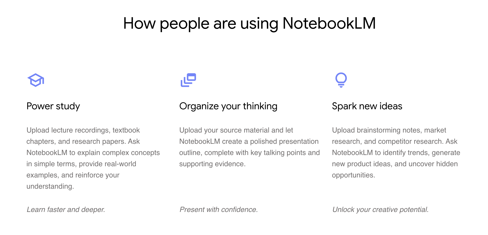

# Intro to NotebookLM

## Analyze PDFs

Better understand research papers!

Upload PDF -> Click source and see source guide. Click on keywords to learn about those topics or ask questions about them.

When the answer has citations, click on it. It takes us to the lines where it was mentioned in the paper/source. Verify answers.

In source guide, copy a peice of text and use the suggestions to save it as is in note, summarize and save to note, and also better understand it.

To know sth better, like what are the main contributions of the paper? Ask it in chat!

Or to summarize a research paper:

Specific Problem
Motivation
Claims
Approach
Result Highlights
Evidence to support Claims
Conclusion

To generate study guides, ideas, create outline etc., select all notes and use the suggested options as needed. Or in chat write: Create one short slide for the concepts mentioned in the notes.

## Generate Audio Overviews

Click notebook guide and hit audio generate, wait a few minutes.

## Summarizing and Formatting content

To convert a text format into markdown. Do it with the chat feature, for example, in the chat, write:

Generate the papers in markdown format. Use the following format: | **Paper**  | **Links** |

| ------------- | ------------- |

| 1) **** -  | [Paper](), [Tweet]() |

| 2) **** -  | [Paper](), [Tweet]() |

| 3) **** -  | [Paper](), [Tweet]() |

| 4) **** -  | [Paper](), [Tweet]() |

This can save time by not having to do the formatting ourselves.

## Chatting with videos

Here is the YouTube video of the deep discussion around prompt engineering: https://youtu.be/T9aRN5JkmL8?si=vJ6jFlB6oZ5jIMAP

Prompt used: Generate the top 20 prompt engineering tips in the discussion. Use 2 sentences max and start with a heading and then an explanation using the format: “Heading: explanation”.

## Improving technical guide

Add text outputs from video or a paper into another source using the add source option but with text, then copy the output that is in the note into the text field to add it as another source. This is useful, when we want to integrate sth into a larger piece of code or documentation.

## Improving slides

From slides, suggest questions, make exercises, notes etc.

Slide: https://docs.google.com/presentation/d/1fxwhjqP4saNa91pOwfupIuaELu0s5pGo-FZsntxZlcM/edit?usp=sharing

Some example prompts to interact with slides:

- Can you add a multiple choice quiz for Slide 10 along with correct answers?
- Can you write a detailed explanations to Slide 15?
- I want to build an exercise on the prompting techniques. Can you please help with some creative exercises for the students to work on.