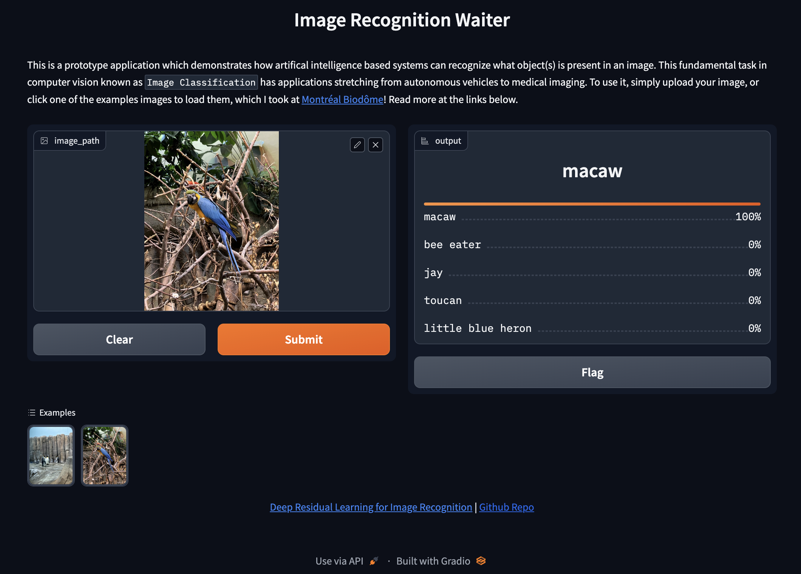

# Image classifier

This is code for image classification using a deep learning model, deploy in Google Cloud Run. More details are [imagercg-waiter](https://github.com/hasibzunair/imagercg-waiter/).

A frontend webapp is built that accepts images from user. The webapp then calls the REST API which has a deep learning model to make predictions. Finally, the predictions are then showed to the user.

You can find the app temporarily at https://webappimagercg-j3y7zumhxa-uc.a.run.app/. Will take it down after my GCP free credits are finished.

## Backend API

See [image-classification/backend](https://github.com/hasibzunair/learn-mlops/tree/main/projects/image-classification/backend).

## Frontend Webapp

See [image-classification/frontend](https://github.com/hasibzunair/learn-mlops/tree/main/projects/image-classification/frontend).

## Todos

- Cloud functions?
- Cloud run and function difference?
- Deploy API and frontend app using Terraform?

## References

- https://cloud.google.com/run/docs/quickstarts/build-and-deploy/deploy-python-service
- https://github.com/GoogleCloudPlatform/python-docs-samples/tree/main/run
